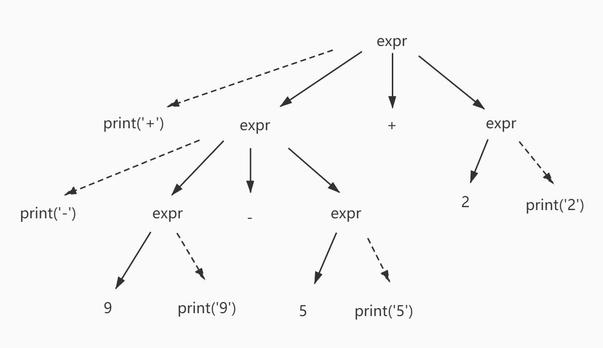
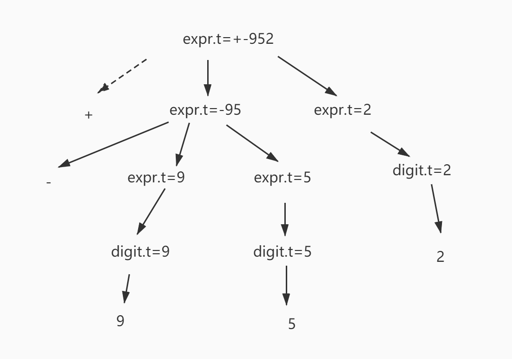
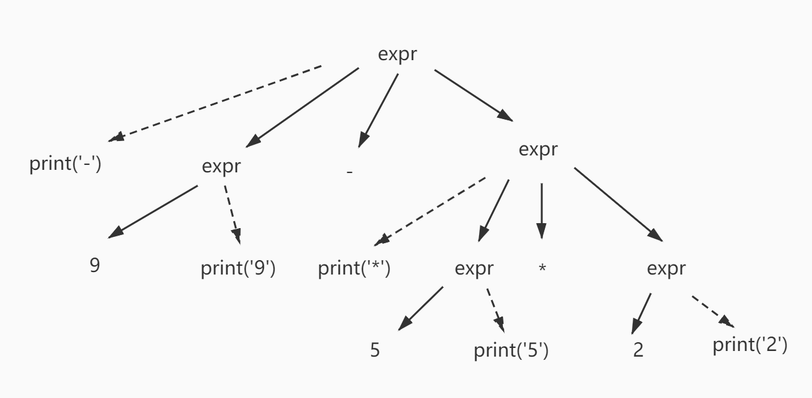
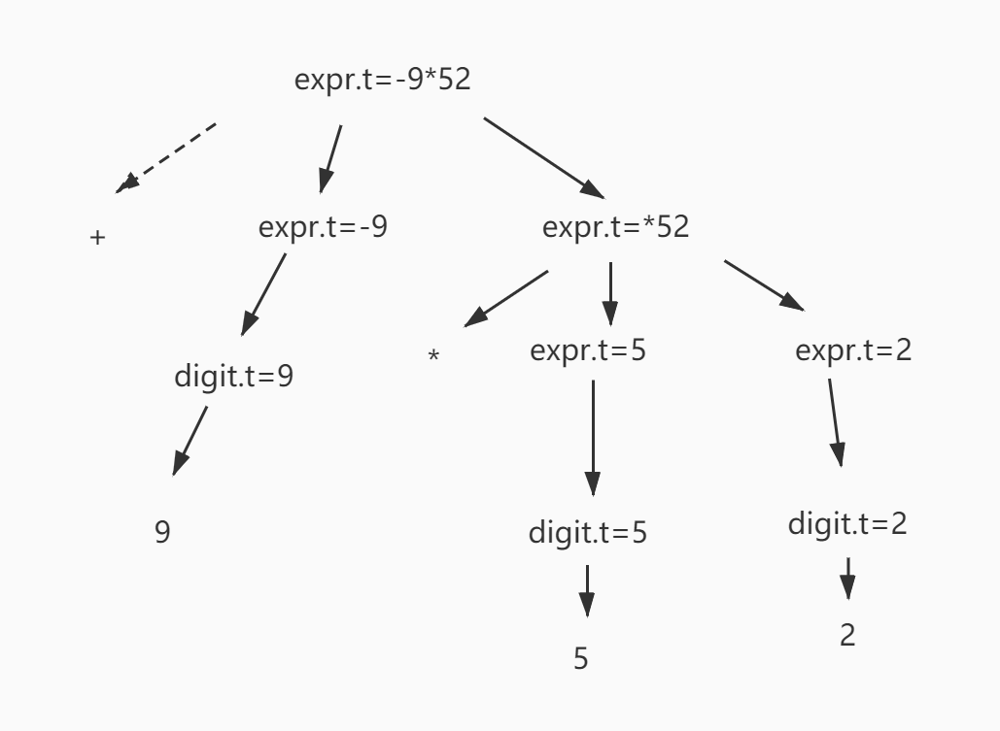

##### 2.3.1
  构建一个语法指导翻译方案，该方案把算术表达式从中缀表示方式翻译成运算符在运算分量之前的前缀表示方式。例如，-xy是表达式x-y的前缀表示法。给出输入9-5+2和9-5*2的注释分析树。

 后缀产生式：
 ````
  expr -> expr expr + | expr expr - | expr expr * | expr expr / | digit
  digit -> 0|1|2|3|4|5|6|7|8|9 
 ````

 翻译模式：
 ````
  expr -> {print('+')} expr + expr
  expr -> {print('-')} expr - expr
  expr -> {print('*')} expr * expr
  expr -> {print('/')} expr / expr
  expr -> digit {print(digit)}
 ````

9-5+2语义动作：
  

9-5+2注释分析树：
  
9-5*2语义动作：


9-5*2注释分析树：
