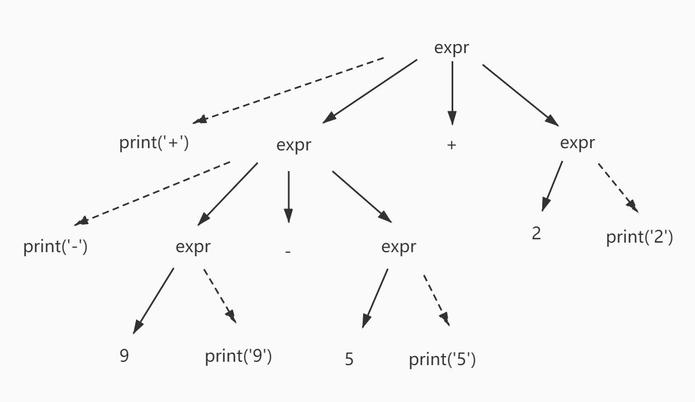
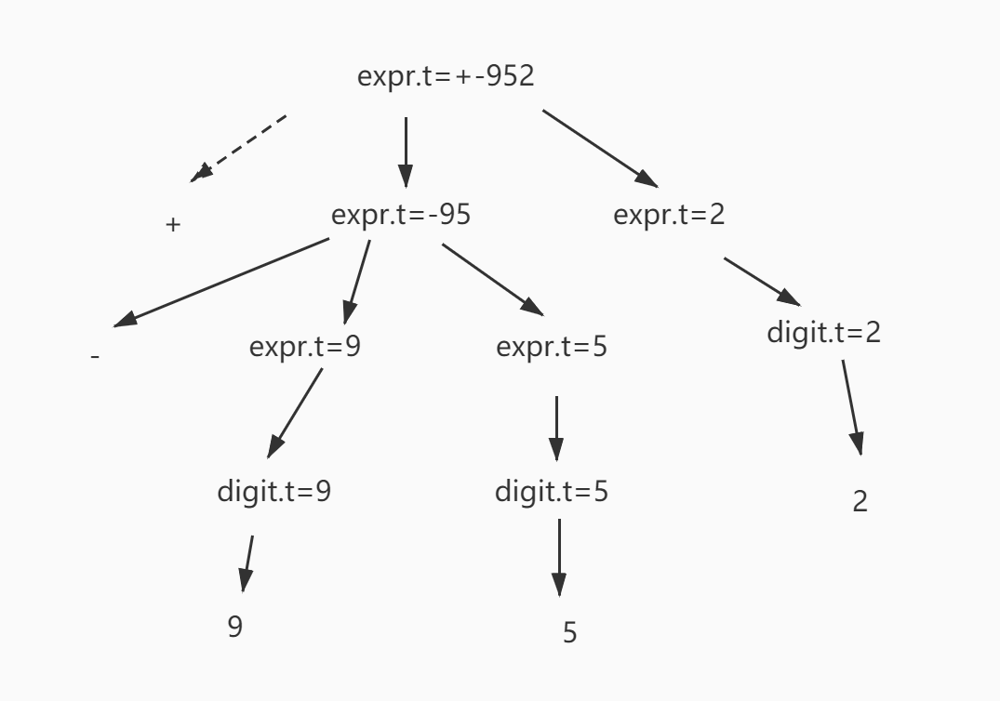
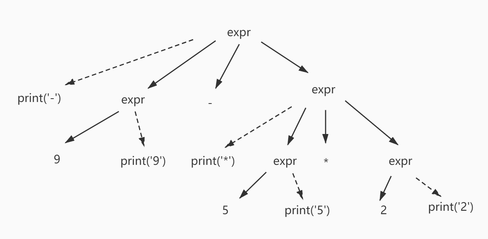
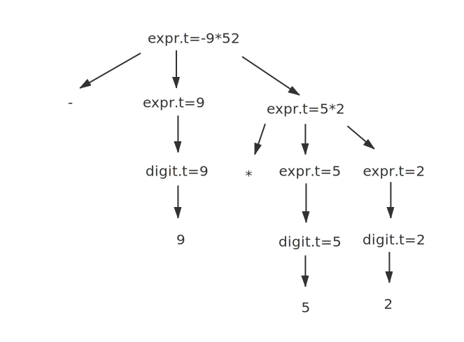
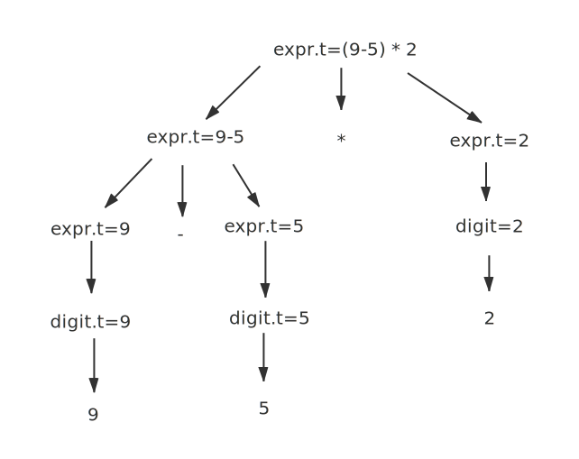
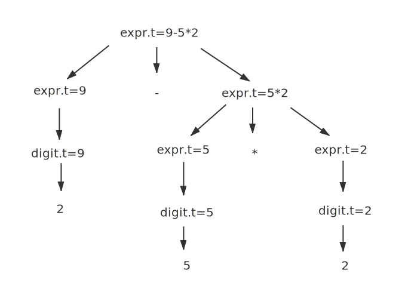

##### 2.3.1
  构建一个语法指导翻译方案，该方案把算术表达式从中缀表示方式翻译成运算符在运算分量之前的前缀表示方式。例如，-xy是表达式x-y的前缀表示法。给出输入9-5+2和9-5*2的注释分析树。

 中缀产生式：
 ````
  expr -> expr + expr  | expr - expr | expr  * expr | expr / expr | digit
  digit -> 0|1|2|3|4|5|6|7|8|9 
 ````

 翻译模式：
 ````
  expr -> {print('+')} expr + expr
  expr -> {print('-')} expr - expr
  expr -> {print('*')} expr * expr
  expr -> {print('/')} expr / expr
  expr -> digit {print(digit)}
 ````
9-5+2  +-952
9-5+2语义动作：


9-5+2注释分析树：

9-5*2语义动作：


9-5*2注释分析树：


##### 2.3.2 
  构建一个语法指导方案，该方案将算术表达式从后缀表达式翻译成中缀表达式。给出95-2* 和 952*-的注释分析树。

  后缀产生式：
  ````
  expr -> expr expr + | expr expr - | expr expr * | expr expr / | digit
  digit -> 0|...|9
  ````
  翻译模式：
  ````
  expr -> {print('(')} expr {print('+')} expr + {print(')')}
  expr -> {print('(')} expr {print('-')} expr - {print(')')}
  expr -> expr {print('*')} expr *
  expr -> expr {print('/')} expr /
  expr -> digit {print(digit)}
  ````
  95-2*的注释分析树：
  

  952*-的注释分析树：
  

  ##### 2.3.3
  构建一个将整数翻译成罗马数字的语法制导翻译方案
  ````
  一下方案只考虑0-3999
  辅助函数
  repeat(sign, times)
  -----------
  num -> thousands hundreds tens singles {num.roman = thousands.roman || hundreds.roman || tens.roman || singles.roman; print(num.roman) }
  thousands -> low {thousands.roman = repeat('M', low.v)}
  hundreds -> low {hundreds.roman = repeat('C', low.v) }
             | 4 {hundreds.roman = 'CD'} 
             | high {hundreds.roman = 'D' || repeat('C', high.v - 5)}
             | 9 {hundreds.roman = 'CM'}
  tens -> low {tens.roman = repeat('X', low.v)}
        | 4 {tens.roman = 'XL'}
        | high {tens.roman = 'L' || repeat('X', high.v - 5)}
        | 9 {tens.roman = 'XC'}
  singles -> low {singles.roman = repeat('I', low.v)}
          | 4 {singles.roman = 'IV'}
          | high {singles.roman = 'V' || repeat('I', high.v - 5)}
          | 9 {singles.roman = 'IX'}
  low  -> 0 {low.v = 0}
        | 1 {low.v = 1}
        | 2 {low.v = 2}
        | 3 {low.v = 3}
  high -> 5 {high.v = 5}
        | 6 {high.v = 6}
        | 7 {high.v = 7}
        | 8 {high.v = 8}
  ````

  ##### 2.3.4
  构建一个将罗马数字翻译成整数的语法制导翻译方案
  ````
  罗马数字的产生式：
  romanNum -> thousands || hundreds || tens || singles

  thousands -> M | MM | MMM | ε
  hundreds  -> C | CC | CCC | CD | D | DC | DCC | DCCC | CM | ε
  tens -> X | XX | XXX | XL | L |LX | LXX | LXXX | XC | ε
  singles -> I | II | III | IV | V | VI | VII | VIII | IX | ε

  翻译模式：
  romanNum -> thousands || hundreds || tens || singles {romanNum.num = thousands.num || hundreds.num || tens.num || singles.num; print(romanNum.num)}

  thousands -> low {thousands.num = low.v}
  hundreds -> lowHundreds {hundreds.num = lowHundreds.v}
            | CD {hundreds.num = 4}
            | D lowHundreds {hundreds.num = 5 +  lowHundreds.v}
            | CM {hundreds.num = 9}
  lowHundreds -> C {lowHundreds.v = 1}
               | CC {lowHundreds.v = 2}
               | CCC {lowHundreds.v = 3}
               | ε {lowHundreds.v = 0}
  tens -> lowTens {ten.num = lowTens.v}
        | XL {tens.num = 4}
        | L lowTens {tens.num = 5 + lowTens.num}
        | XC {tens.num = 9}
  lowTens -> X {lowTens.v = 1}
           | XX {lowTens.v = 2}
           | XXX {lowTens.v = 3}
           | ε {lowTens.v = 0}
  singles -> lowSingles {singles.num = lowSingles.v}
           | IV {singles.num = 4}
           | V lowSingles {singles.num = 5 + lowSingles.v}
           | IX {singles.num = 9}
  lowSingles -> I {lowSingles.v = 1}
              | II {lowSingles.v = 2}
              | III {lowSingles.v = 3}
              | ε {lowSingles.v = 0}
  ````

  ##### 2.3.5
  构建一个将后缀算术表达式翻译成等价的前缀算术表达式的语法制导翻译方案

  翻译模式：
  ````
  expr -> {print('+')} expr  expr + 
  expr -> {print('-')} expr  expr - 
  expr -> {print('*')} expr  expr * 
  expr -> {print('/')} expr  expr / 
  expr -> digit {print(digit)}
  ````
  


